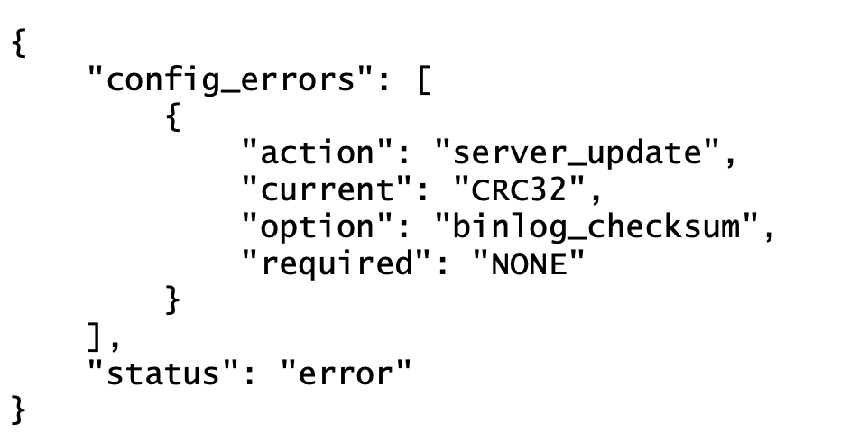
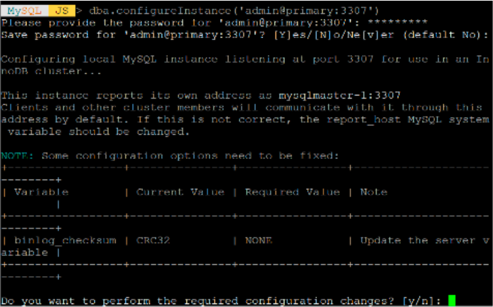
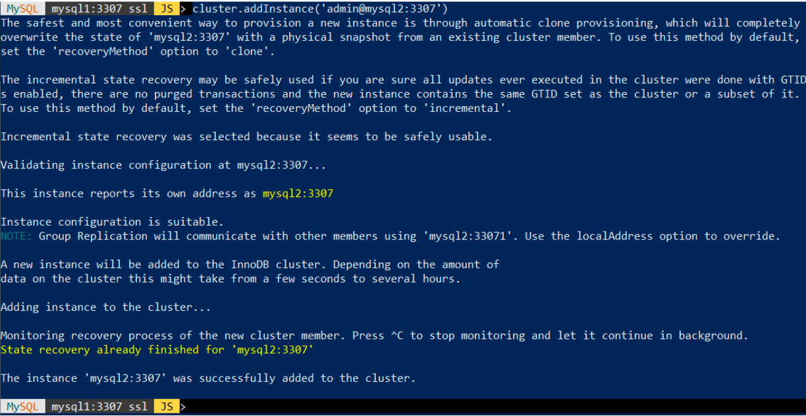
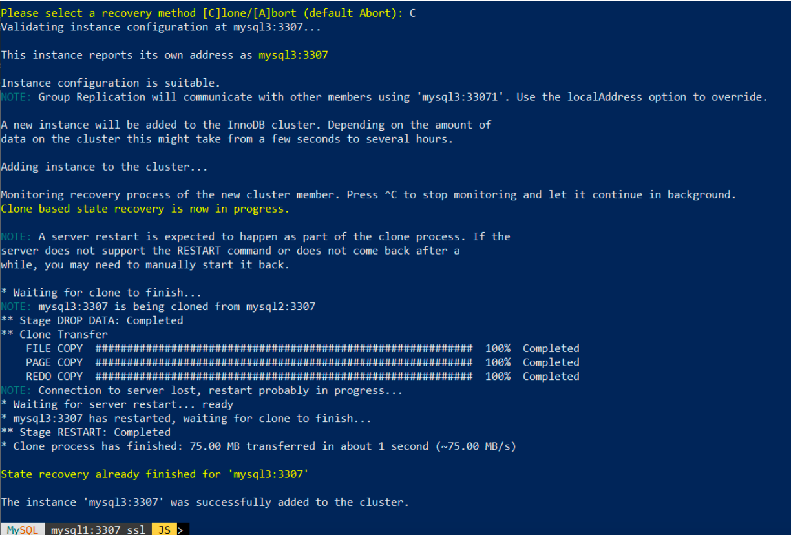
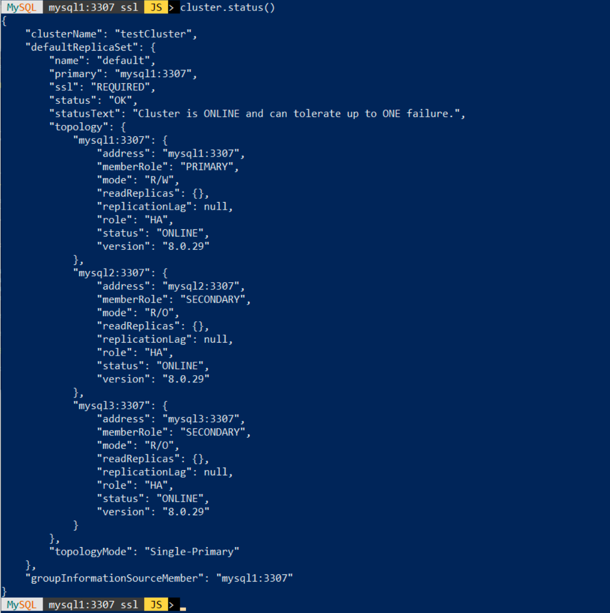

# MySQL InnoDB Cluster

## Introduction
An InnoDB Cluster consists of at least three MySQL Server instances, and it provides high-availability and scaling features.

In this lab you will create 3 nodes MySQL InnoDB Cluster as Single Primary and have a trial on the MySQL Shell to configure and operate. And you will be using MySQL Router to test for Server routing and test for Failover.


Estimated Lab Time: 40 minutes

### Objectives
In this lab, you will:
* Check and, if required, fix data model for InnoDB Cluster compatibility
* Configure InnoDB Cluster in single primary (mysql1 as primary)
* Configure mysql router
* Test client connection with MySQL Router, read/write and read only
* Simulate a crash of primary instance

> **Note:**
 * MySQL InnoDB cluster require at least 3 instances (refer to schema in the first part of the lab guide) 
    * mysql1willbetheprimary
    * mysql2 and mysql3 will be first secondaries
 *  We use here different ways to configure the secondaries


## Task 1: Prepare to create Cluster
1. From app-srv, connect to mysql1 and verify data model compatibility with Group replication requirements. If needed, fix the errors
    * Connect to instance
        ```
        <span style="color:green">shell-app-srv$</span><copy>mysql -uadmin -p -hmysql1 -P3307</copy>
        ```
    * Search non InnoDB tables and if there are you must change them. <span style="color:red">For this lab just drop them</span>
        ```
        <span style="color:blue">mysql-primary></span><copy>SELECT table_schema, table_name, engine, table_rows, (index_length+data_length)/1024/1024 AS sizeMB
        FROM information_schema.tables
        WHERE engine != 'innodb'
        AND table_schema NOT IN ('information_schema', 'mysql', 'performance_schema');</copy>
        ```
    * Search InnoDB tables without primary or unique key. In production you must fix, here it's enough that you <span style="color:red">drop them</span>
        ```
        <span style="color:blue">mysql-primary></span><copy>SELECT tables.table_schema, tables.table_name, tables.engine, tables.table_rows
        FROM information_schema.tables
            LEFT JOIN (select table_schema, table_name
            FROM information_schema.statistics
            GROUP BY table_schema, table_name, index_name HAVING
            SUM(CASE
                    WHEN non_unique = 0
                    AND nullable != 'YES' then 1 ELSE 0
                    END
                ) = count(*)
            ) puks
            ON tables.table_schema = puks.table_schema
            AND tables.table_name = puks.table_name 
        WHERE puks.table_name is null
            AND tables.table_type = 'BASE TABLE'
            AND engine='InnoDB'
            AND tables.table_schema NOT IN ('information_schema', 'mysql', 'performance_schema');</copy>
        ```
        ```
        <span style="color:blue">mysql-primary></span><copy>DROP TABLE world.city_part;</copy>
        ```
        ```
        <span style="color:blue">mysql-primary></span><copy>exit</copy>
        ```
2. Thanks to replication, instance on mysql2 is ready for cluster. Just stop replication
    * Connect with administrative account
        ```
        <span style="color:green">shell-app-srv$</span><copy>mysql -uadmin -p -hmysql2 -P3307</copy>
        ```
    * Stop and remove the replication and the server is ready to be used
        ```
        <span style="color:blue">mysql-secondary-1></span><copy>stop replica;</copy>
        ```
        ```
        <span style="color:blue">mysql-secondary-1></span><copy>reset replica all;</copy>
        ```
        ```
        <span style="color:blue">mysql-secondary-1></span><copy>exit</copy>
        ```
3. Now we need a third instance, we create a new one on mysql3 
    * If not already stared, start mysql3 instance with OCI dashboard
    * Connect to <span style="color:red">mysql3</span> through app-srv
        ```
        <span style="color:green">shell-app-srv$</span><copy>ssh -i $HOME/sshkeys/id_rsa_mysql3 opc@mysql3</copy>
        ```
    * Execute below script that replicate what we did in manual installation lab (create mysqluser/mysqlgrp, folders and install binaries and enterprise plugins, create the admin user)
        ```
        <span style="color:green">shell-mysql3></span><copy>/workshop/support/MySQL_InnoDB_Cluster___secondary_on_mysql3.sh</copy>
        ```
4. Verify that the instance is up and running.

    Login to verify that the instance is accessible and empty, then close the connection (we don’t need it).
    We use “sudo” because PATH and ownerships requires assigned by previous script requires a logoff+logon.

    ```
    <span style="color:green">shell-mysql3></span><copy>sudo /mysql/mysql-latest/bin/mysql -uadmin -p -hmysql3 -P 3307</copy>
    ```
    ```
    <span style="color:blue">mysql3></span><copy>SELECT @@hostname;</copy>
    ```
    ```
    <span style="color:blue">mysql3></span><copy>exit</copy>
    ```
    ```
    <span style="color:green">shell-mysql3></span><copy>exit</copy>
    ```


## Task 2: Create Cluster 
1. We can do it from any server, we use here app-srv

    ```
    <span style="color:green">shell-app-srv$ </span><copy>mysqlsh</copy>
    ```
2. Check the instance configuration
    ```
    <span style="color:blue">My</span><span style="color: orange">SQL </span><span style="background-color:yellow">JS</span>> <copy>dba.checkInstanceConfiguration('admin@mysql1:3307')</copy>
    ```

    If the check may return errors, we use MySQL Shell to fix with the command. e.g.

    

    ```
    <span style="color:blue">My</span><span style="color: orange">SQL </span><span style="background-color:yellow">JS</span>> <copy>dba.configureInstance('admin@mysql1:3307')</copy>
    ```

    
        
3. Just to be sure, re-check the instance configuration and verify that you receive an "ok" message
    ```
    <span style="color:blue">My</span><span style="color: orange">SQL </span><span style="background-color:yellow">JS</span> <copy>dba.checkInstanceConfiguration('admin@mysql1:3307')</copy>
    ```

    The instance 'primary:3307' is valid for InnoDB cluster usage.
    
        
4. Create the cluster.
    ```
    <span style="color:blue">My</span><span style="color: orange">SQL </span><span style="background-color:yellow">JS</span>> <copy>\connect admin@mysql1:3307</copy>
    ```

    ```
    <span style="color:blue">My</span><span style="color: orange">SQL </span><span style="background-color:yellow">JS</span>> <copy>var cluster = dba.createCluster('testCluster')</copy>
     ```

    

5. Verify cluster status (why "Cluster is NOT tolerant to any failures" ?)
    ```
    <span style="color:blue">My</span><span style="color: orange">SQL </span><span style="background-color:yellow">JS</span>> <copy>cluster.status()</copy>
    ```

    

## Task 3: Add a second and third server to the cluster
1. Check the instance configuration, and probably it produces the same error as the first ‘primary:3307’
    ```
    <span style="color:blue">My</span><span style="color: orange">SQL </span><span style="background-color:yellow">JS</span>> <copy>dba.checkInstanceConfiguration('admin@mysql2:3307')</copy>
    ```

2. Use MySQL Shell to fix issues
    ```
    <span style="color:blue">My</span><span style="color: orange">SQL </span><span style="background-color:yellow">JS</span>> <copy>dba.configureInstance('admin@mysql2:3307')</copy>
    ```
    
3.  Add the instance to the cluster
    ```
    <span style="color:blue">My</span><span style="color: orange">SQL </span><span style="background-color:yellow">JS</span>> <copy>cluster.addInstance('admin@mysql2:3307')</copy>
    ```

    

4. Verify cluster status
    ```
    <span style="color:blue">My</span><span style="color: orange">SQL </span><span style="background-color:yellow">JS</span>> <copy>cluster.status()</copy>
    ```


    

5. Now we add the third node to cluster, check the instance configuration
    ```
    <span style="color:blue">My</span><span style="color: orange">SQL </span><span style="background-color:yellow">JS</span>> <copy>dba.checkInstanceConfiguration('admin@mysql3:3307')</copy>
    ```
6. If there are issues (we missed something...), read the messages and fix with
    ```
    <span style="color:blue">My</span><span style="color: orange">SQL </span><span style="background-color:yellow">JS</span>> <copy>dba.configureInstance('admin@mysql3:3307')</copy>
    ```
7. Add the last instance to the cluster
    ```
    <span style="color:blue">My</span><span style="color: orange">SQL </span><span style="background-color:yellow">JS</span>> <copy>cluster.addInstance('admin@mysql3:3307')</copy>
    ```
8. Because the instance is empty, we receive an alert. We use now the clone plugin
    

9. Type ‘C’ and confirm. This start the clone process
    

10. Verify cluster status, now with all three servers
    ```
    <span style="color:blue">My</span><span style="color: orange">SQL </span><span style="background-color:yellow">JS</span>> <copy>cluster.status()</copy>
    ```

    

11. Verify the new status. How do you recognize the Primary server?
12. Exit from MySQL Shell
    ```
    <span style="color:blue">My</span><span style="color: orange">SQL </span><span style="background-color:yellow">JS</span>> <copy>\q</copy>
    ```


## Task 4: Deploy MySQL Router
> **Note:** 
* By default MySQL router uses mysql_native_password (deprecated) for its user, we force the usage of the new chaching_sha2 with the option "--force-password-validation" at bootstrap time.

1.  Install MySQL Router via rpm package
    ```
    <span style="color:green">shell-app-srv$</span><copy>sudo yum -y install /workshop/linux/mysql-router-commercial-8.0.*.x86_64.rpm</copy>
    ```

2. Configure MySQL Router
    ```
    <span style="color:green">shell-app-srv$</span><copy>sudo mysqlrouter --bootstrap admin@mysql1:3307 --user=mysqlrouter --force-password-validation</copy>
    ```

    Have a look on the output, note the following:
    * Read/Write Connections port: 
    * Read/Only Connections:

3. Start MySQL Router
    ```
    <span style="color:green">shell-app-srv$</span><copy>sudo systemctl start mysqlrouter</copy>
    ```

4. Test the connection with a mysql client connect to 6446 port (read/write). To which server are you currently connected? Can you change the content?

    ```
    <span style="color:green">shell-app-srv$</span><copy>mysql -uadmin -p -h127.0.0.1 -P6446</copy>
    ```
    ```
    <span style="color:blue">mysql-rw></span><copy>SELECT @@hostname, @@port;</copy>
    ```
    ```
    <span style="color:blue">mysql-rw></span><copy>use newdb;</copy>
    ```
    ```
    <span style="color:blue">mysql-rw></span><copy>SHOW TABLES;</copy>
    ```
    ```
    <span style="color:blue">mysql-rw></span><copy>CREATE TABLE newtable (c1 int primary key);</copy>
    ```
    ```
    <span style="color:blue">mysql-rw></span><copy>INSERT INTO newtable VALUES(1);</copy>
    ```
    ```
    <span style="color:blue">mysql-rw></span><copy>INSERT INTO newtable VALUES(2);</copy>
    ```
    ```
    <span style="color:blue">mysql-rw></span><copy>SELECT * from newtable;</copy>
    ```
    ```
    <span style="color:blue">mysql-rw></span><copy>exit</copy>
    ```

5. The second port of MySQL Router is used for read only sessions. Close session and re open on port 6447 (read only port).
    To which server are you currently connected? Can you change the content?
    ```
    <span style="color:green">shell-app-srv$</span><copy>mysql -uadmin -p -h127.0.0.1 -P6447</copy>
    ```
    ```
    <span style="color:blue">mysql-ro></span><copy>SELECT @@hostname, @@port;</copy>
    ```
    ```
    <span style="color:blue">mysql-ro></span><copy>use newdb;</copy>
    ```
    ```
    <span style="color:blue">mysql-ro></span><copy>SELECT * from newtable;</copy>
    ```
    ```
    <span style="color:blue">mysql-ro></span><copy>INSERT INTO newtable VALUES(3);</copy>
    ```
    ```
    <span style="color:blue">mysql-ro></span><copy>show variables like '%read_only';</copy>
    ```
    ```
    <span style="color:blue">mysql-ro></span><copy>exit</copy>
    ```
6. Reconnect to primary instance through the router. <span style="color:red">Please keep this session open!</span>
    ```
    <span style="color:green">shell-app-srv$</span><copy>mysql -uadmin -p -h127.0.0.1 -P6446</copy>
    ```
    ```
    <span style="color:blue">mysql-rw></span><copy>SELECT @@hostname, @@port;</copy>
    ```
7. <span style="color:red">Open a second SSH connection</span> to mysql1 and simulate a crash killing primary instance. To do so retrieve process ID with one of these commands
    ```
    <span style="color:green">shell-app-srv$</span><copy>ssh -i $HOME/sshkeys/id_rsa_mysql1 opc@mysql1</copy>
    ```
    ```
    <span style="color:green">shell-mysql1></span><copy>cat /mysql/data/*.pid</copy>
    ```
    * the kill the process of primary instance to simulate a crash
        ```
        <span style="color:green">shell-mysql1></span><copy>sudo kill -9 <process id from previous step></copy>
        ```
    * <span style="color:red">Return to mysql connection previously opened</span> and verify if it works. It may requires 15/2 seconds to be online.
        ```
        <span style="color:blue">mysql-rw></span><copy>SELECT @@hostname, @@port;</copy>
        ```
        ```
        <span style="color:blue">mysql-rw></span><copy>SELECT @@hostname, @@port;</copy>
        ```
        ```
        <span style="color:blue">mysql-rw></span><copy>INSERT INTO newdb.newtable VALUES(30);</copy>
        ```
        ```
        <span style="color:blue">mysql-rw></span><copy>SELECT * from newdb.newtable;</copy>
        ```

8. From the shell where you killed the instance use MySQL Shell to verify cluster status (of course connect to a living instance)
    ```
    <span style="color:green">shell-app-srv$</span><copy>mysqlsh</copy>
    ```
    ```
    <span style="color:blue">My</span><span style="color: orange">SQL </span><span style="background-color:yellow">JS</span>> <copy>\c admin@mysql1:3307</copy>
    ```
    ```
    <span style="color:blue">My</span><span style="color: orange">SQL </span><span style="background-color:yellow">JS</span>> <copy>var cluster = dba.getCluster()</copy>
    ```
    ```
    <span style="color:blue">My</span><span style="color: orange">SQL </span><span style="background-color:yellow">JS</span>> <copy>cluster.status()</copy>
    ```
9. Optional: restart "crashed" instance and verify with MySQL Shell how it changes the status
    ```
    <span style="color:blue">My</span><span style="color: orange">SQL </span><span style="background-color:yellow">JS</span>> <copy>cluster.status()</copy>
    ```


## Acknowledgements
* **Author** - Marco Carlessi, Principal Sales Consultant
* **Contributors** -  Perside Foster, MySQL Solution Engineering, Selena Sánchez, MySQL Solutions Engineer
* **Last Updated By/Date** - Selena Sánchez, MySQL Solution Engineering, May 2023
